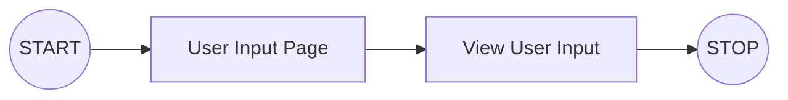
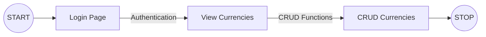

# Full Stack Developer Challenge

You have 2 challenges as part of this challenge series.

- Challenge 1 is to create a form using PHP to display the input on another page.
- Challenge 2 is to create a project which would require authentication, after which the user is able to CRUD currencies and their exchange rate, preferably using the MERN stack of MySQL variation.

**Note:** Please don't fork this repository, or create a pull request against it.

## Challenge 1 - PHP Challenge

### Workflow Overview

### Challenge Specifications

For this challenge, you are required to create a form where the user is required to input their -

- First Name
- Last Name
- Contact Number (Inclusive of optional country code)
- Email
- Website/LinkedIn Profile URL

It is important that the form comprises of the necessary validations for each type of input.

## Challenge 2 - MERN Challenge

### Workflow Overview

### Backend Challenge

For the backend part of the challenge, you would need to create a **Backend Server,** preferably with NodeJS, with database connection to your local **MySQL server**.

The schema, tables and data required within the database can be imported using the `dev-challenge.mwb` for database schema creation and `currency.csv` and `user.csv` files to load the data into the respective tables.

You would need to implement the APIs for the frontend to perform the CRUD functions.

### Frontend Challenge

For the frontend part of the challenge, you would need to create a User Interface, preferably with **ReactJS**.

The pages required for the User Interface are:

1. Login
2. View Currencies
3. CRUD Currencies

| Page            | Requirement                                   |
| --------------- | --------------------------------------------- |
| Login           | Authenticate user using username and password |
| View Currencies | Dashboard to view all currencies              |
| CRUD Currencies | Page to make changes to currencies            |

### Object Types

| Object/Table | Parameters |
| ------------ | ---------- |
| **user**     | username   |
|              | password   |
| **currency** | base       |
|              | counter    |
|              | rate       |

`currency.base` is the local/domestic currency
`currency.counter` is the foreign currency being compared against

---

## Submission

You can submit your challenge by zipping up your projects in separate folders, named php, frontend and backend respectively, and emailed back.
